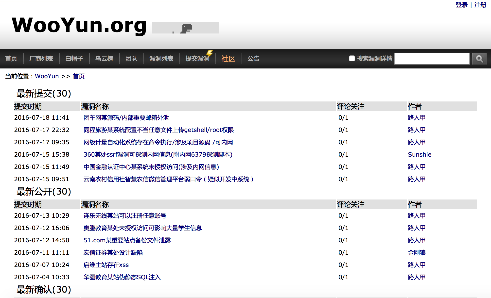
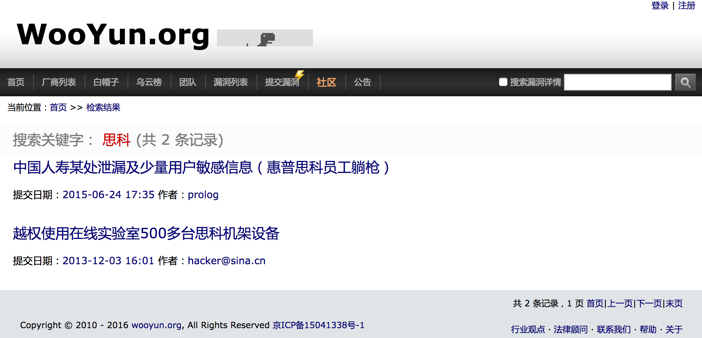

# wooyun_public
**乌云公开漏洞、知识库爬虫和搜索**
**crawl and search for wooyun.org public bug(vulnerability) and drops**

1.wooyun公开漏洞爬虫版
--------

源自2016年6月底使用scrapy爬虫爬取的4W公开漏洞和知识库，虚拟机为ubuntu14.04，采用python2+mongodb+flask(tornado)和Elasticsearch搜索引擎。

虚拟机下载地址：

[https://pan.baidu.com/s/1HkR4ggvAwTikshsjcKYBuA](https://pan.baidu.com/s/1HkR4ggvAwTikshsjcKYBuA) ，提取密码：8wnb（2018.4.23更新）

[安装、使用指南（点我）](README_PUBLIC.md)

2.wooyun公开漏洞纪念版
--------

漏洞信息和代码来自于[m0l1ce的wooyun_all_bugs_8.8W](https://github.com/m0l1ce/wooyunallbugs)，包含8.8W漏洞信息（不含知识库）；搜索和漏洞信息代码位于wooyun_final，对代码进行了部份修改:

+ 修改了搜索功能，支持多关键字搜索和在漏洞详情中搜索
+ 修改了离线图片文件的位置，搜索结果直接使用虚拟机中的离线图片
+ 修改了代码以适应PHP5.6及更新版本

虚拟机为ubuntu16.04，PHP5.6+MySQL5.7+Apache2。虚拟机下载地址：
[https://pan.baidu.com/s/1qYRqa3U](https://pan.baidu.com/s/1qYRqa3U) 密码: w8vb (2017.7.4)

虚拟机用户名、密码为hancool/qwe123

3.其它
--------

+ 本程序只用于技术研究和个人使用，程序组件均为开源程序，漏洞和知识库来源于乌云公开漏洞，版权归wooyun.org。

