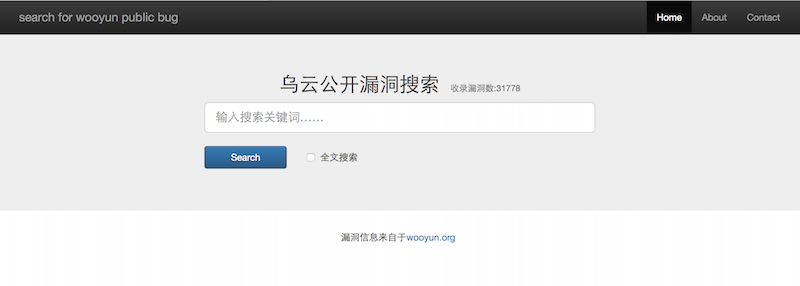
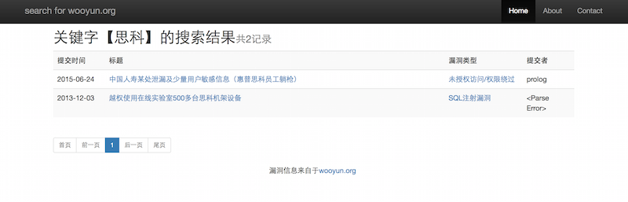

# wooyun_public
**乌云公开漏洞、知识库爬虫和搜索**

**crawl and search for wooyun.org public bug(vulnerability) and drops**




1.依赖组件
--------
+ python 2.7和pip
+ mongodb
+ scrapy
+ flask 或者 tornado
+ pymongo
+ Elasticsearch (搜索引擎，可选）

 [在ubuntu下的安装过程（点我）](install.md)


2.爬虫（由于wooyun已不可访问，爬虫功能已不可用）
--------

+ 乌云公开漏洞和知识库的爬虫分别位于目录scrapy/wooyun和scrapy/wooyun_drops

+ 运行scrapy crawl wooyun -a page_max=1  -a local_store=false -a update=false，有三个参数用于控制爬取：

	    -a page_max: 控制爬取的页数，默认为1，如果值为0，表示所有页面
	    -a local_store: 控制是否将每个漏洞离线存放到本地，默认为false  
	    -a update：控制是否重复爬取，默认为false

+ 第一次爬取全部内容时，用scrapy crawl wooyun -a page_max=0 -a update=true

+ 平时只爬取最近的更新时，用scrapy crawl wooyun -a page_max=1，可以根据自己的爬取频率和网站更新情况调整page_max的值

+ 全部公开漏洞的列表和每个漏洞的文本内容存在mongodb中，大概约2G内容；如果整站爬全部文本和图片作为离线查询，大概需要10G空间、2小时（10M电信带宽）；爬取全部知识库，总共约500M空间。（截止2015年10月）

3.搜索
--------
+ 漏洞搜索使用了Flask作为web server，bootstrap作为前端（8.12增加tornador web server，可配合nginx反向代理，支持高并发的应用）

+ 启动web server ：在flask目录下运行./app.py，默认端口是5000

+ #### 启动Elassticsearch（如果已配置了Elasticsearch）：在elasticsearch-2.3.4/bin目录下运行./elasticsearch -d (-d表示以后台方式运行）

  注：elasticsearch 5.x版本需将flask/app.py中的搜索方式改为bool搜索。
  即将```search_mongodb_by_es```函数中的```query_dsl```替换为如下所示

```
...
      if keywords.strip() == '':
            query_dsl = {
                "query": {
                    "bool": {
                        "must": {
                            "match_all": {}
                        }
                    }
                },
                "sort": {"datetime": {"order": "desc"}},
                "from": row_start,
                "size": ROWS_PER_PAGE
            }
        else:
            query_dsl = {
                "query": {
                    "bool": {
                        "must": {
                            "match": {
                                field_name: {
                                    'query': keywords,
                                    'operator': 'and'
                                }
                            }
                        }
                    }
                },
                "sort": {"datetime": {"order": "desc"}},
                "from": row_start,
                "size": ROWS_PER_PAGE
            }
...
```

+ 搜索：在浏览器通过http://localhost:5000进行搜索漏洞，多个关键字可以用空格分开。

+ 默认使用mongodb的数据库搜索，在进行全文搜索时比较慢，推荐安装使用Elasicsearch搜索引擎。[安装和配置Elasicsearch的方法（点我）](elasticsearch_install.md)

4.为mongodb数据库创建索引
--------
```bash
mongo
use wooyun
db.wooyun_list.ensureIndex({"datetime":1})
db.wooyun_drops.ensureIndex({"datetime":1})
```

5.虚拟机
------

+ 虚拟机：在2016年6月底爬的wooyun全部漏洞库和知识库内容，集成了Elasticsearch搜索，总共35G（压缩后约14G），网盘地址为： [https://pan.baidu.com/s/1HkR4ggvAwTikshsjcKYBuA](https://pan.baidu.com/s/1HkR4ggvAwTikshsjcKYBuA) ，提取密码：8wnb（2018.4.23更新）

	使用方法：

		1、压缩包解压后是一个vmware虚拟机的镜像，可以由vmware直接打开运行；
		2、由于在制作压缩包时虚拟机为“挂起”状态，当前虚拟机的IP地址可能和宿主机的IP地址段不一致，请将虚拟机重启后重新获取IP地址，虚拟机用户密码为hancool/qwe123；
		3、进入wooyun_public目录，先用git更新一下到最新的代码git pull（如果提示merge冲突，先进行git reset --hard origin/master后再git pull）；
		4、在elasticsearch-2.3.4/bin目录下运行./elasticsearch -d (-d表示以后台方式运行）
		5、进入wooyun_public/flask目录，运行./app.py；
		6、打开浏览器，输入http://ip:5000，ip为虚拟机的网卡地址（使用ifconfig eth0查看）

  注：推荐将mongodb升级至最新版本，可将数据部分缩减至1G以内（800M左右）。

6.其它
--------

+ 本程序只用于技术研究和个人使用，程序组件均为开源程序，漏洞和知识库来源于乌云公开漏洞，版权归wooyun.org。

+ 期待雨过天晴、重开wooyun!
